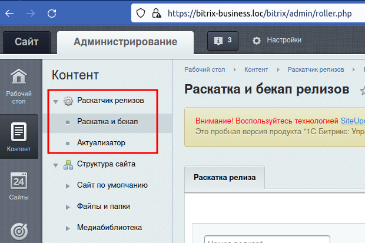

#Раскатчик релизов для CMS Битрикс

##Для чего нужно?

Модуль для битрикса, который поможет деплоить релизы без системы контроля версий.

##Установка

Скопировать содержимое репозитория в папку с проектом битрикса

```
/local/modules/vorozhko.roller
```

И установить через Marketplace.

После установки в системе создастся hl-блок 'Releases', куда будет записываться информация о проведенных релизах.

Кроме того, в меню "Контент" появится специальный раздел:


## Раскатка и бекап

Тут надо выбрать файл релиза и указать номер релиза. Это обязательно.

Так же можно добавить описание к релизу по желанию.

Кроме того релизиться можно 2 способами

- Релиз (при этом способе создается бекап и отдается браузеру на скачивание)
- Бекап (отличие только в том, что бекап не создается)

Вообще вся фишка этого модуля в автоматическом создании бекапа. Если бекап по какой-то причине не создался или созданный архив оказался битым - раскатки релиза не произойдет.

##Как собрать релиз?

Собрать релиз на деве из последнего коммита при наличии гита можно командой

```
git archive -o patch.zip HEAD $(git diff --name-only HEAD^..HEAD)
```

Для Винды есть специальный [батник](assets/bat/release_from_last_commit.bat).

#Актуализатор

Актуализатор соберет архив с указанными файлами проекта.

Каждый путь должен начинаться с новой строки.

Пути надо указывать от корня проекта:

```
bitrix/php_interface/init.php
/bitrix/php_interface/init.php
```
Оба варианта будут понятны для модуля

Кроме того, можно указать папку и тогда все файлы и папки из неё будут добавлены в архив рекурсивно.

Примеры валидных указаний директорий:

```
bitrix/php_interface/include
/bitrix/php_interface/include
/bitrix/php_interface/include/
bitrix\php_interface\include
\bitrix\php_interface\include
\bitrix\php_interface\include\
```

Все эти пути будут понятны модулю так как слеши он заменит на DIRECTORY_SEPARATOR, используемый системой.
